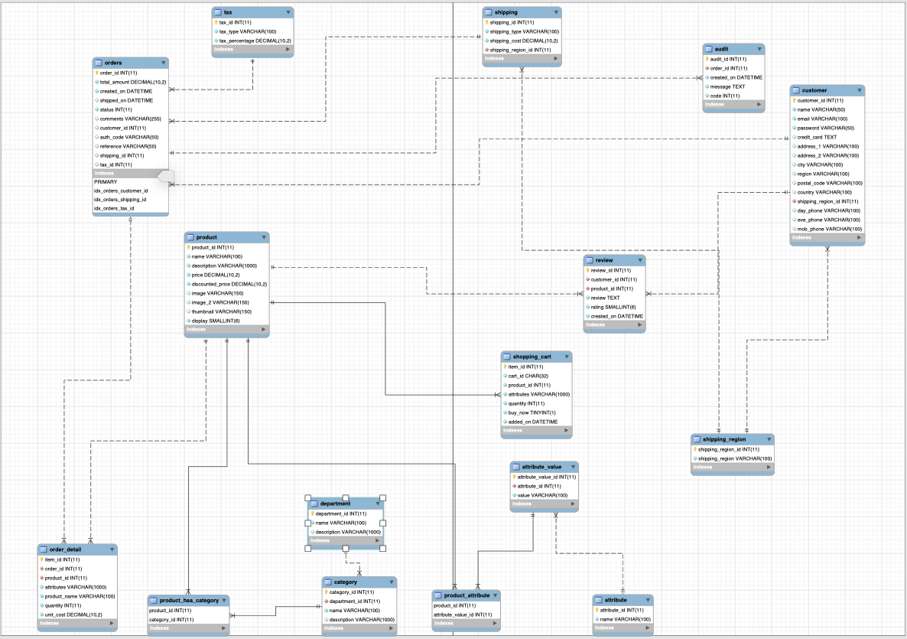

# e-shopify

An e-commerce system which allows users to search, add items to their shopping cart, create order and checkout successfully.

## Table of Contents

- [Features](#features)
- [API-DOCUMENTATION](#API-DOCUMENTATION)
- [Technologies](#technology)
- [Architecture](#Architecture)
- [Installation](#installation)
- [Testing](#testing)
- [Contribution](#contribution)
- [Frequently Asked Questions](#faqs)
- [License](#license)

## Features

It consists of the following features:

- Users can see all items when entering the website.
- Items are displayed properly based on the selected department and category.
- Users can search items through search box.
- Supports paging if we have too many items.
- Users can see item details by selecting a specific item.
- Users can add items to their shopping carts.
- Users can register/login using website custom forms, or social login libraries.
- Users can checkout with Stripe.
- Users gets confirmations over emails about their orders.

## API-DOCUMENTATION
Check out the API docs at [e-shopify](https://eshopify.docs.apiary.io/#)

## Technology
**e-shopify** makes use of a host of modern technologies. The core ones are:
- [JavaScript](https://www.javascript.com/)
- [React](https://facebook.github.io/react/)
- [Redux](http://redux.js.org/)
- [NodeJs](https://nodejs.org)
- [Express](http://expressjs.com/)
- [Mysql](https://www.mysql.com)
- [Sequelize ORM](http://docs.sequelizejs.com/en/v3/)

## Architecture
It below is the Application backend Database Design and Architecture

The App uses a Monolith Architecture because the app is composed in one piece. 
It contains layers below

Authorization — responsible for authorizing a user

Presentation — responsible for handling HTTP requests and responding with either HTML or JSON/XML (for web services APIs).

Business logic — the application’s business logic. The application business logic are all on the backend so to avoid repetition while integrating other clients if need be.

Database layer — data access objects responsible for accessing the database.

Application integration — integration with other services (Facebook and Stripe).

Notification module — responsible for sending email notifications whenever needed.

Caching Module - responsible for caching.

## Installation

- Install [NodeJs](https://nodejs.org/en/) and [Mysql](https://www.mysql.com) on your machine
- Clone the repository
- Change into the directory `$ cd /e-shopify`
- Install all required dependencies with `$npm install`
- Create a `.env` file in your root directory as described in `.env.sample` file
- Start the app with `npm start`

## Testing

- `npm test`

## Contribution

- Fork this repository to your GitHub account
- Clone the forked repository
- Create your feature branch
- Commit your changes
- Push to the remote branch
- Open a Pull Request
  **Note** when making contributions, please endevour to follow the [Airbnb](https://github.com/airbnb/javascript) javascript style guide.

## FAQs

Contact tosmak16@gmail.com

## LICENSE

#### [MIT](./LICENSE) © [Oluwatosin Akinola]

Copyright (c) 2019 Oluwatosin Akinola
